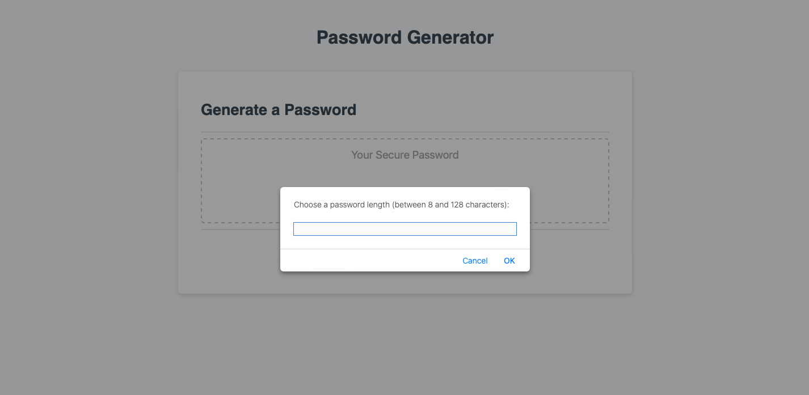

# Password-Producer

## Description

A password generator with options to select for length between 8 and 128 characters with options to include uppercase, lowercase, numeric and special characters. Demonstrates practical debugging experience and javascript knowledge; query selector, event listener, for loops, conditional statements, parseInt(), inNaN(), Math.floor(), Math.random(), charAt(), etc. 

## Link to Deployed Website

https://spec-tr.github.io/Password-Producer/

## Technologies

### JavaScript
### HTML
### CSS

## Credits & Sources

Information and documentation used in the creation of this app, but external to the EdX UofT Full-Stack Software Development Bootcamp including syntaxes, best practises and instructional examples for usage came from the following sources:
- https://developer.mozilla.org/en-US/docs/Web/API/Window/prompt
- https://developer.mozilla.org/en-US/docs/Web/JavaScript/Reference/Global_Objects/isNaN
- https://developer.mozilla.org/en-US/docs/Web/JavaScript/Reference/Operators/Addition_assignment
- https://www.w3schools.com/jsref/met_win_confirm.asp
- https://www.w3schools.com/java/ref_string_charat.asp
- https://www.w3schools.com/jsref/jsref_parseint.asp

## License

See LICENSE file in repository